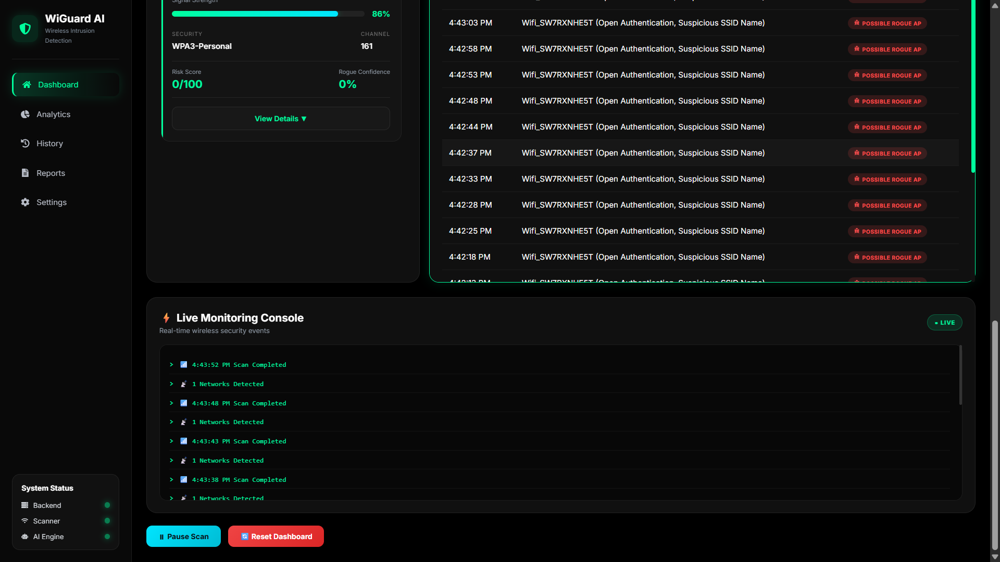

# 🛡️ WiGuard AI – Intelligent Wi-Fi Intrusion Detection System

WiGuard AI is a lightweight AI-assisted Wireless Intrusion Detection System (WIDS) that continuously monitors nearby Wi-Fi networks and identifies suspicious access points using multiple heuristic detection techniques.

Unlike traditional Wi-Fi scanners, WiGuard AI focuses on early attack detection by analyzing network behavior, RSSI fluctuations, duplicate SSIDs, timing patterns, authentication methods, and suspicious network characteristics.

---

## 📌 Problem Statement

Current Wi-Fi systems are not efficient at detecting fake wireless access points and early-stage wireless attacks.

The objective of WiGuard AI is to develop a lightweight detection system that uses multiple techniques such as:

- RSSI Analysis
- Timing Analysis
- Deauthentication Effect Monitoring
- Duplicate SSID Detection
- Authentication Analysis
- Rogue Access Point Detection

to identify suspicious wireless activity before users connect to malicious networks.

---

# ✨ Features

### 📡 Real-Time Wi-Fi Scanning

- Detects nearby Wi-Fi networks directly from Windows.
- Displays SSID, BSSID, Signal Strength, Channel and Security.

---

### 🤖 Intelligent Threat Detection

WiGuard AI analyzes every detected network using multiple detection techniques.

Implemented techniques include:

- Duplicate SSID Detection
- Hidden SSID Detection
- Open Authentication Detection
- Weak Encryption Detection (WEP/WPA)
- RSSI (Signal Strength) Analysis
- Timing Analysis
- New Network Appearance Detection
- Suspicious SSID Detection
- Rogue Access Point Detection

---

### 📈 Live Dashboard

- Live Wi-Fi monitoring
- Risk score visualization
- Security status indicators
- Threat cards
- Event timeline

---

### 📊 Analytics

Interactive charts for:

- Signal Strength Trend
- Threat Distribution
- Networks Detected
- Rogue AP Trend

---

### 📜 Scan History

- Stores previous scans
- Searchable history
- Risk statistics
- Timestamped events

---

### 📄 Security Reports

Generate:

- CSV Reports
- PDF Reports

Includes:

- Overall Security Status
- Rogue AP Count
- Threat Summary
- Scan Statistics

---

### ⚙ Settings

- Notification controls
- Auto scanning
- Scan interval configuration
- Backend status monitoring

---

# 🧠 Detection Techniques

## 1. Duplicate SSID Detection

Multiple networks broadcasting the same SSID may indicate an Evil Twin attack.

---

## 2. Authentication Analysis

Flags networks using:

- Open Authentication
- WEP
- Legacy WPA

---

## 3. RSSI (Signal Strength) Analysis

Monitors sudden signal strength fluctuations which may indicate:

- Fake Access Points
- Rogue Devices
- Device Relocation

---

## 4. Timing Analysis

Tracks when a Wi-Fi network first appears.

A network that suddenly appears and immediately advertises strong connectivity is treated as suspicious.

---

## 5. Deauthentication Effect Monitoring

WiGuard AI monitors the effects commonly produced after deauthentication attacks instead of capturing raw deauthentication frames.

Indicators include:

- Sudden disappearance of known APs
- Immediate reappearance
- Rapid signal fluctuations
- Unexpected network instability

This lightweight approach avoids the need for monitor mode while still providing early warning signs.

---

# 🛠 Tech Stack

### Frontend

- React.js
- Vite
- Recharts
- Axios
- React Icons

### Backend

- Node.js
- Express.js

### Detection Engine

- Windows netsh WLAN Scanner
- Custom Detection Engine
- Risk Calculation Module

### Data Storage

- JSON-based Scan History

---

# 📂 Project Structure

```
client/
    src/
        components/
        pages/
        styles/
        services/

server/
    controllers/
    routes/
    services/
    data/
    config/
```

---

# 🚀 Installation

## Clone repository

```bash
git clone https://github.com/YOUR_USERNAME/WiGuard-AI.git
```

---

## Client

```bash
cd client
npm install
npm run dev
```

---

## Server

```bash
cd server
npm install
npm start
```

---

Open

```
http://localhost:5173
```

---

# 📸 Screenshots

## 📸 Screenshots

### 🏠 Dashboard

The main dashboard provides a real-time overview of nearby Wi-Fi networks, security status, detected threats, and recent security events.




---

### 📊 Analytics

Visualizes network statistics, threat distribution, signal strength trends, and rogue access point detection using interactive charts.


---

### 📜 Scan History

Displays previously recorded Wi-Fi scans with timestamps, network counts, security status, and detected threats.


---

### 📄 Security Reports

Generate comprehensive security reports with threat summaries and export them as CSV or PDF.


---

### ⚙️ Settings

Configure scan preferences, notification options, scan intervals, and view backend connection status.


# 🔮 Future Enhancements

- Linux Monitor Mode Support
- Real Packet Capture
- Deauthentication Frame Detection
- Machine Learning Threat Classification
- Email & SMS Alerts
- Database Integration
- Multi-device Monitoring
- Cloud Dashboard
- Docker Deployment

---

# ⚠ Limitations

Current implementation runs on Windows using the native `netsh` command.

Windows does not provide raw 802.11 frame capture through netsh, therefore:

- Actual deauthentication frames cannot be directly captured.
- WiGuard AI detects the observable effects of deauthentication attacks instead of raw packets.
- Timing and RSSI analysis are used as lightweight alternatives.

---

# 👨‍💻 Author

**Madhu Mitha**

Computer Science Engineering Student

---

# ⭐ If you like this project

Give it a ⭐ on GitHub!
